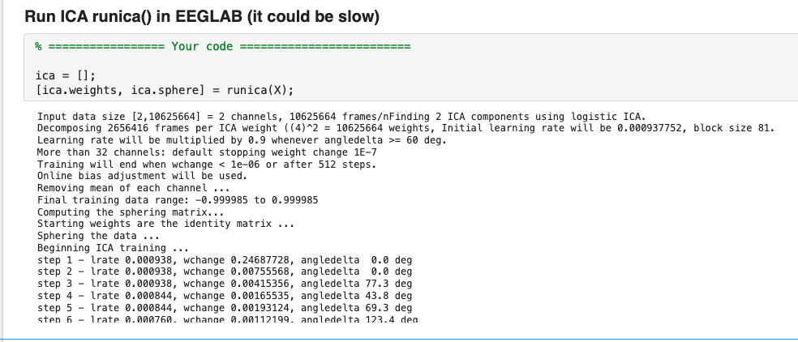
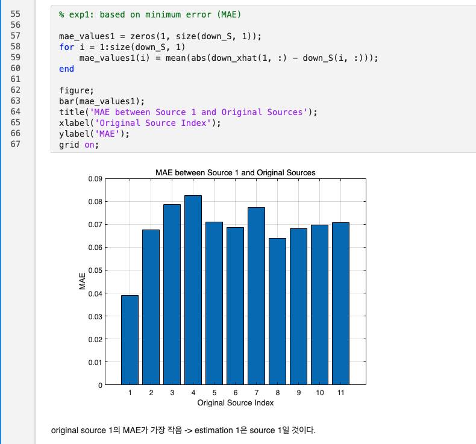

# Week 4 Homework: ICA on Mixed Audio

## Description
* “This is an assignment to separate an audio mix using Independent Component Analysis (ICA).
 Since the runica and resample functions from EEGLAB are required, please install EEGLAB and set up the path before proceeding.
 Unzip the example_sound_sources.zip file and copy it to the data directory of the repository.
 Read the mixed_audio_2mix_v2.wav file and practice separating the ICA and mixed signals.
 hw_ica_students.pdf is a file converted from the repository’s MATLAB live script to PDF. 
 The same code can be executed in MATLAB, but some parts of the code necessary for the assignment are left blank.
 Referring to the Week 4 practice materials will help in applying ICA easily.”

## Submission File

* Upload everything in a single zip file
   * MATLAB script used for the assignment
   * *.wav files separating the audio mix

## Result

* Run ICA runica() in EEGLAB

* Compare source 1 (downsampling for comparison) vs. original sources
   * based on MAE
       
   * based on correlation (You can check this result in the MATLAB  script.)
   * based on Spectogram (You can check this result in the MATLAB  script.)
* Compare source 2 (downsampling for comparison) vs. original sources
   * based on MAE (You can check this result in the MATLAB  script.)
   * based on correlation (You can check this result in the MATLAB  script.)
   * based on Spectogram (You can check this result in the MATLAB  script.)
       